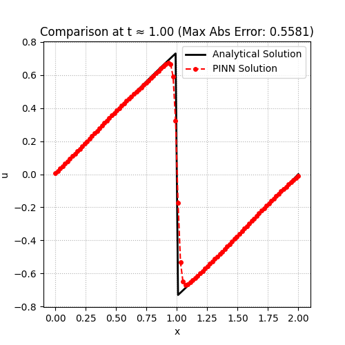
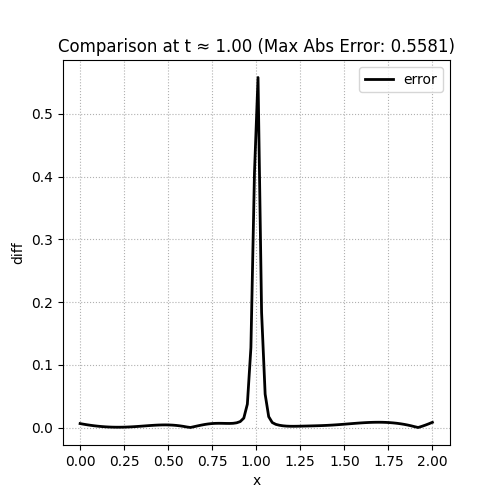
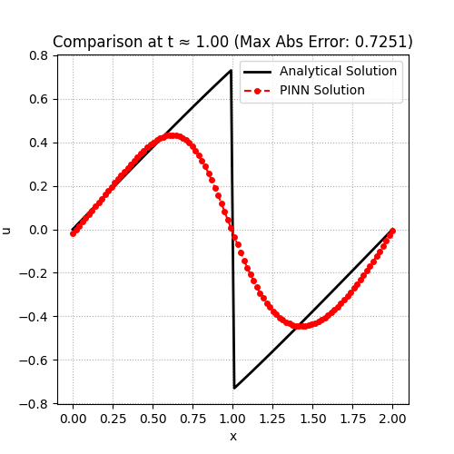
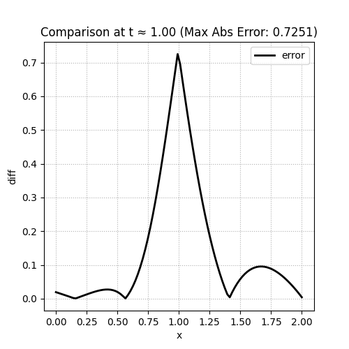
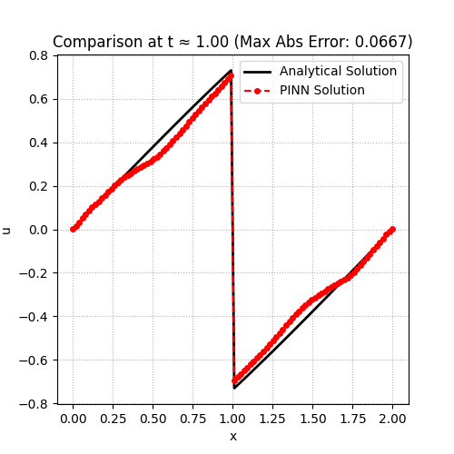
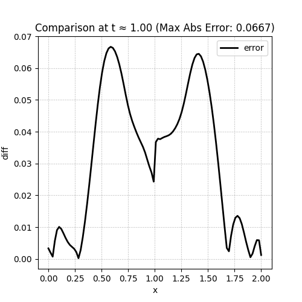

PINN-WE方法

训练5500次,使用原论文中4层MLP网络，每层30个神经元。
经过尝试发现
$\omega_{pde} = 1.0,\omega_{ibc} = 10.0,\omega_{rh} = 0.9$ 时效果较好，但是与论文效果出入较大。

  
  

使用原论文参数$\omega_{pde} = 1.0,\omega_{ibc} = 10.0,\omega_{rh} = 10.0$，训练5500次，结果很奇怪。

  
  

尝试使用Fourier网络，训练2000次，可以精准捕捉到不连续，但是在其他地方效果不好。
$\omega_{pde} = 2.0,\omega_{ibc} = 10.0,\omega_{rh} = 1.0$

  
  

